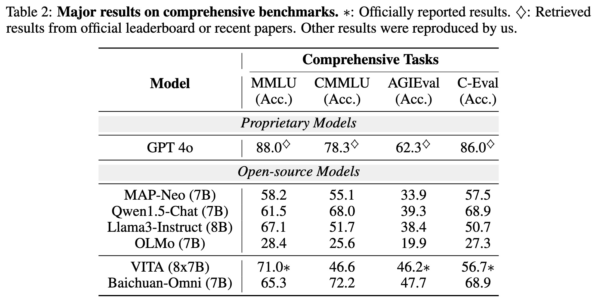

# Baichuan-Omni: 
<!-- TODOs: Replace vita staff with Baichuan -->
## 1. Introduction
Baichuan-Omni is a high-performing open-source Multimodal Large Language Model (MLLM) developed by Baichuan Ltd and the School of Engineering at Westlake University. It delivers an advanced multimodal interactive experience in image, video, audio, and text. In the project, we propose an effective multimodal training schema starting with the Baichuan 7B model and proceeding through two stages of multimodal alignment and multitask fine-tuning
across audio, image, video, and text modal. This approach equips the language model with the ability to handle visual and audio data effectively. Demonstrating strong performance across various unimodal and multimodal benchmarks, we aim for this contribution to serve as a competitive baseline for the open-source community in advancing multimodal understanding and real-time interaction.
<!-- 

 

 -->

<!-- 

 

 -->

## 2. News
- [TBD] We have released technical report for **Baichuan-Omni**! See [here](https://www.overleaf.com/project/66e3d40121950eb2655a99c5)!

## 3. Structure & Training schema
In terms of interactivity, the model initially predicts the start and end of audio inputs. During this period, incoming images and videos are encoded into features and fed into the MLLM in a streaming fashion to calculate attention. The audio features are then input into the MLLM for inference following the end of the audio input,
facilitating streaming input of audio and video.

**Pretraining.** During the pretraining phase, we initially train a vision-language model using extensive image-text data, followed by training an audio-language model with ASR data. Subsequently, we integrate high-quality images, audio, and video data for comprehensive multimodal alignment. 

**Fine-tuning.** We synthesize a subset of cross-modal interaction
data to blend with existing high-quality datasets. From this enriched dataset, we select a subset of
data that the model is already capable of handling and proceed with multimodal multitask fine-tuning.
This process aims to enhance the model’s adherence to omni-modal instructions.

## 4. Experimental Results
### 4.1 Language understanding

### 4.2 Image understanding

### 4.3 Video understanding

### 4.4 Audio understanding