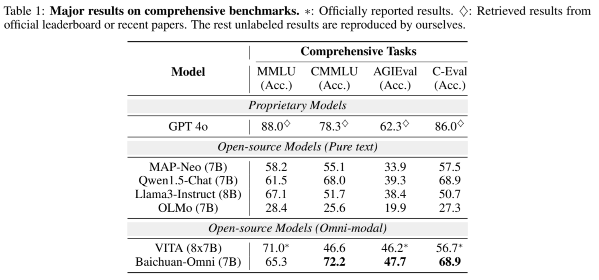
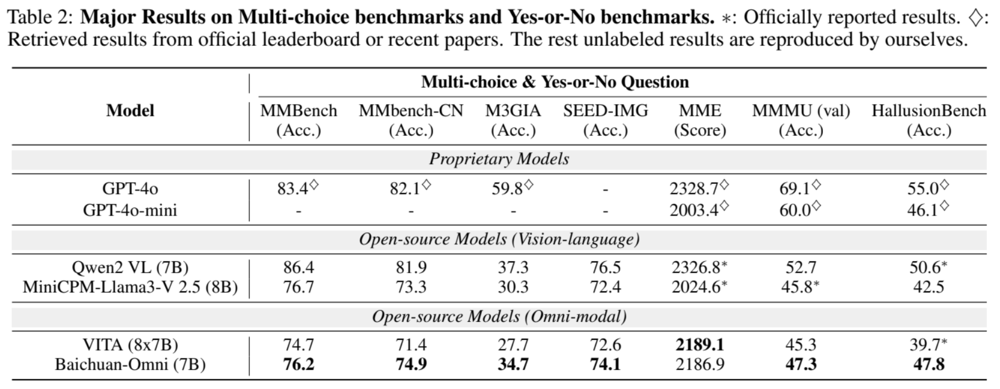

<h2 align="center"> <a href="https://arxiv.org/abs/2405.14297">Baichuan-Omni Technical Report</a></h2>
<h5 align="center"> If our project helps you, please give us a star ⭐ and cite our <a href="#citation">paper</a>!</h2>
<h5 align="center">

<!-- TODO：改成我们自己的链接 -->

  

  
    
      

## News
- **[2024/10/xx]** 🔥 We have released technical report of **Baichuan-Omni**. See [here](https://www.overleaf.com/project/66e3d40121950eb2655a99c5)!

## Introduction
The salient multimodal capabilities and interactive experience of GPT-4o highlight its critical role in practical applications, yet it lacks a high-performing open-source counterpart.

In this paper, we introduce Baichuan-Omni, the first high-performing open-source Multimodal Large Language Model (MLLM) adept at concurrently processing and analyzing modalities of image, video, audio, and text, while delivering an advanced multimodal interactive experience. We propose an effective multimodal training schema starting with 7B model and proceeding through two stages of multimodal alignment and multitask fine-tuning across audio, image, video, and text modal. 

This approach equips the language model with the ability to handle visual and audio data effectively. Demonstrating strong performance across various omni-modal and multimodal benchmarks, we aim for this contribution to serve as a competitive baseline for the open-source community in advancing multimodal understanding and real-time interaction.

## Architecture & Training Schema

The training pipeline is divided into two phases:

**Phase 1: Multimodal Alignment Pretraining.** The pre-training and alignment processes consist of Image-Language, Video-Language, and Audio-Language branches.
  - The Image-Language branch utilizes a visual encoder to process images and undergoes training in three stages, focusing on image captioning, visual question answering tasks, and further enhancing alignment with the large language model (LLM).
  - The Video-Language branch builds on the Image-Language branch, using the same visual encoder and video projector, and trains with a mix of image-text and video-text pairs.
  - The Audio-Language branch incorporates the Whisper-large-v3 model's audio encoder and a novel convolutional-gated MLP projector, replacing traditional pooling methods to retain more audio information. Finally, the Omni-Alignment stage integrates all branches, training on high-quality multimodal data pairs to enhance the model's multimodal understanding capabilities.

**Phase 2: Multimodal Supervised Fine-Tuning.** The multimodal supervised fine-tuning process designed to enhance the model's ability to follow complex instructions across various tasks, utilizing a dataset of over 600K pairs spanning multiple modalities.
  - The text-only data encompasses a wide range of tasks, emphasizing complex, multi-step instructions.
  - For image understanding, we employed the vFLAN dataset, applying a loss-based filtering method to improve data quality and translating the data into Chinese for better alignment.
  - The video understanding component is sourced from the VideoInstruct100K dataset, where we implemented semantic deduplication and translation to diversify the instructions.
  - In the audio understanding part, we generated audio using text-to-speech technology, ensuring quality through transcription verification and supplementing it with human-recorded samples to capture diverse dialects.

## Experimental Results

We conducted a comprehensive evaluation across various modalities, including language, image understanding, video understanding, and audio understanding. The results indicate that Baichuan-Omni demonstrates superior capabilities in omni-modal comprehension.

### Language understanding

### Image understanding

### Video understanding

### Audio understanding

## Requirements and Installation

## Model Zoo

## Training & Evaluation

## Inference

## Citation